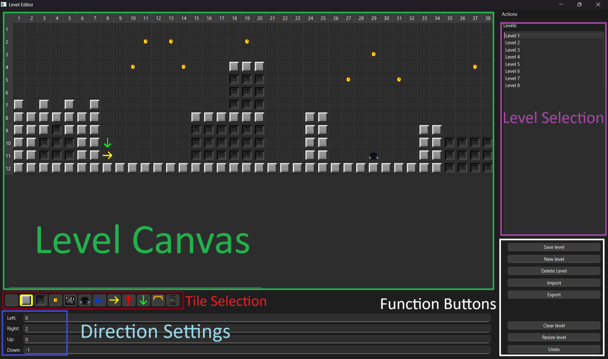

<!DOCTYPE html>
<html lang="en">
<head>
    <meta charset="UTF-8">
    <title>Level Editor Guide</title>
    
</head>
<body>

    <h1>Level-Editor guide</h1>

    

    <h3>Main rule - always press <kbd>Ctrl+S</kbd> to save changes</h3>

    

        <h2>Level Canvas</h2>
        <ul>
            <li>Allow to draw level with clicking or dragging with current selected tile</li>
            <li>Scroll up/down or left/right to see full level</li>
        </ul>
    

    

        <h2>Tile Selection</h2>
        <ul>
            <li>Select current tile to draw in Level Canvas</li>
            <li>Current tile is marked with yellow color box</li>
            <li>First tile is empty tile for erasing</li>
        </ul>
    

    

        <h2>Direction Settings</h2>
        <ul>
            <li>Input numbers into input fields to teleport player to level with this number</li>
            <li>0 or empty means player can get out of bounds</li>
            <li>-1 means player instantly will die there</li>
            <li>-2 means player will instantly win there</li>
        </ul>
    

    

        <h2>Level Selection</h2>
        <ul>
            <li>Select current level to draw inside it</li>
        </ul>
    

    

        <h2>Function Buttons</h2>
        <ul>
            <li>Save level (<kbd>Ctrl+S</kbd>) - to save current changes. (Always save changes by yourself)</li>
            <li>New level (<kbd>Ctrl+N</kbd>) - to make new level in Level Selection. (Note that your current changes lost after New level call)</li>
            <li>Delete level (<kbd>Delete</kbd>) - to delete current level. (Note it's impossible to return deleted level)</li>
            <li>Import (<kbd>Ctrl+I</kbd>) - to import levels.rll files into editor</li>
            <li>Export (<kbd>Ctrl+E</kbd>) - to export files from editor to new location</li>
            <li>Clear level (<kbd>Ctrl+C</kbd>) - to clear all tiles from current level. (Note it's impossible to return cleared level)</li>
            <li>Resize level (<kbd>Ctrl+R</kbd>) - to resize current level size. (Note if you make size smaller, tiles outside will be cleared)</li>
            <li>Undo (<kbd>Ctrl+Z</kbd>) - to return Level Canvas 1 turn back. (Note that there's no redo function)</li>
        </ul>
    

    

        <h2>Tiles Types</h2>
        <ul>
            <li>Air (empty) - don't affect gameplay</li>
            <li>Wall - player can't go through it</li>
            <li>Dark Wall - background, don't affect gameplay</li>
            <li>Coin - reward for player</li>
            <li>Spikes - kill player</li>
            <li>Enemy - move left-right until touch wall, kill player or die to player when he jumps from above on enemy</li>
            <li>Exits (7–10) - decide where player will spawn. They are working with Direction Settings. (Example: green arrow will spawn player only if on another level were Direction setting: (Down 1) that means (player fall down from above to level 1))</li>
            <li>Platform - one-sided wall from top. If Down key pressed become intangible</li>
            <li>Spring - if player touch it, spring sends player to top. (around 2 jumps strength)</li>
        </ul>
    

</body>
</html>
